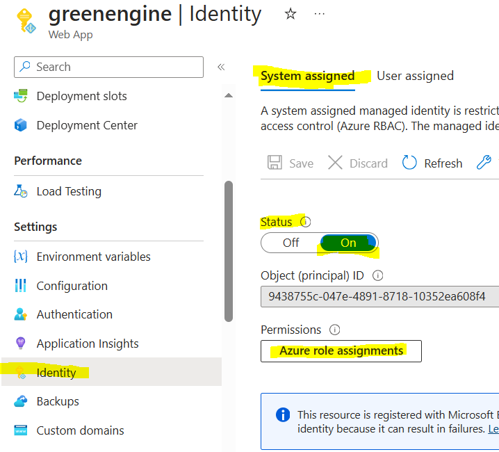
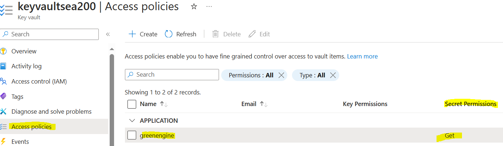
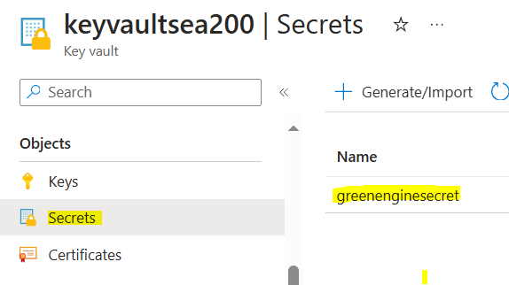
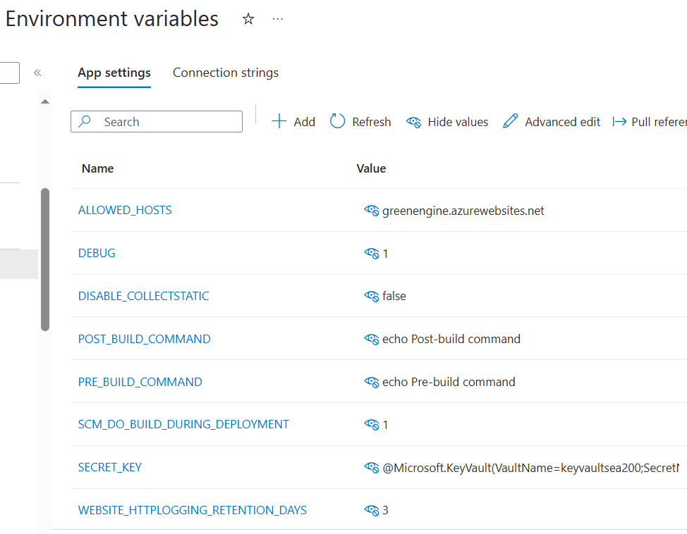

# My Notes 

Being new to Django and Azure Web App, I have encountered many problems setting up the deployment environment of the web app.  After trawling through pages of documentation, I got the deployment done. ✨ Below is the setting that is working.

## Settings.py

`hello_world\template\setting.py` has a few settings that are the reasons for the environment variables and the secrets.

## Secret key

###  Step 1

In the Web App, setup the **Identity**. In the **System assigned**, set the **status** to **on**.


   
###  Step 2

Setup the Key Vault. In the **Access policies**, **Create** a new entity that identifies the Web App.



### Step 3

3.1  Go to **Secrets**. Create a new secret.  Enter a name and a value for the secret.

3.2  For the permissions, only need to select **Secret Permissions** -- **Get**.

3.2  The **name** of the secret will be used in the environment variables. The **uri** of the secret can also be used. But, the setup here uses the name of the secret.



## Environment variables

### Secrets

Notice that **VaultName** is the name of the key vault. This is the name of the key vault resource.

**SecretName** is the name of the secret that was just created above.

```SECRET_KEY = @Microsoft.KeyVault(VaultName=keyvaultsea200;SecretName=greenenginesecret)```

### Allowed hosts

```ALLOWED_HOSTS = greenengine.azurewebsites.net```

### Deployment and build

It is important to set `SCM_DO_BUILD_DURING_DEPLOYMENT` to  `true`. This will build the app during deployment.

```
SCM_DO_BUILD_DURING_DEPLOYMENT=true[or 1]
DEBUG=true[false or 1 or 0]
DISABLE_COLLECTSTATIC=false
PRE_BUILD_COMMAND=echo Pre-build command
POST_BUILD_COMMAND=echo Post-build command
WEBSITE_HTTPLOGGING_RETENTION_DAYS=3
``` 



## Below is the original useful README from the Django templates from GitHub.

---

# GitHub Codespaces ♥️ Django

Welcome to your shiny new Codespace running Django! We've got everything fired up and running for you to explore Django.

You've got a blank canvas to work on from a git perspective as well. There's a single initial commit with what you're seeing right now - where you go from here is up to you!

Everything you do here is contained within this one codespace. There is no repository on GitHub yet. If and when you’re ready you can click "Publish Branch" and we’ll create your repository and push up your project. If you were just exploring then and have no further need for this code then you can simply delete your codespace and it's gone forever.

## installing dependancies

```python
pip install -r requirements.txt
```

## To collect static files:

```python
python manage.py collectstatic
```

## To run this application:

```python
python manage.py runserver
```
